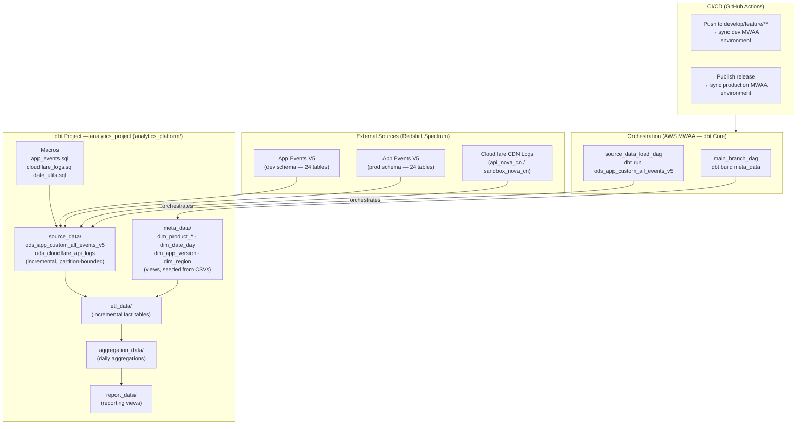

# dbt Analytics Pipeline Migration

---

## Upwork Portfolio Entry

**Project title** (54 / 70 characters)
`dbt Analytics Pipeline Migration — 93 Models, Redshift`

**Role**: Data Engineer

**Project description**

Migrated a production analytics pipeline from hand-written SQL scripts in Airflow to a fully dbt-managed transformation layer on Amazon Redshift Serverless. Re-implemented 93 models across 5 warehouse layers (ODS/DIM/DWD/DWS/ADS). Designed a macro-driven strategy that replaced 24 per-event Airflow SQL tasks with a single parameterized dbt model. Introduced column-level schema tests and source freshness checks across all layers, and established a GitHub Actions CI/CD workflow for dev/production model promotion.

**Skills and deliverables**

- dbt Core + dbt Fusion — 93 models across 5 layers (ODS, DIM, DWD, DWS, ADS)
- Amazon Redshift Serverless — target data warehouse
- Jinja macros — dynamic event union strategy consolidating 24 event types into one parameterized model
- Apache Airflow (AWS MWAA) — dbt CLI integration and DAG orchestration
- GitHub Actions — CI/CD with dev/production promotion via release workflow
- dbt schema tests — column-level validation and source freshness checks on all ODS and DIM models
- Python — incremental model logic and runtime backfill parameter handling
- SQL — analytics transformations across mobile, firmware, and CDN data domains

---

## Full Case Study: dbt Migration — Analytics Platform v4.1

**Role**: Tech Lead — sole data engineer  
**Stack**: dbt Core · dbt Fusion (preview) · Python · Apache Airflow (AWS MWAA) · Amazon Redshift Serverless · Redshift Spectrum · GitHub Actions

---

## Problem

The mobile analytics platform ran its ETL entirely through hand-written SQL scripts executed by Airflow `RedshiftSQLOperator` tasks (see **Mobile Analytics Pipeline** case study, `portfolio-mobile-analytics`). Over time this created several compounding problems:

- **Untestable SQL** — transformation logic lived inside DAG files; no schema tests, no column-level contracts, no way to validate changes before deployment
- **No incremental safety** — source data loads used ad-hoc DELETE + INSERT patterns that were inconsistent across events, making backfills risky
- **Hard to extend** — adding a new app event type meant duplicating boilerplate across multiple DAG files and Redshift scripts
- **No lineage** — no dependency graph between ODS → DIM → DWD → DWS → ADS layers; failures silently propagated downstream
- **Fusion incompatibility** — the team's adoption of the dbt Fusion engine (the next-generation authoring layer) was blocked by deprecated config patterns and unsupported syntax in the existing project

The goal was to migrate all ETL logic to dbt, achieve zero-error compatibility with the Fusion engine, and replace per-event Airflow scripts with a single parameterized dbt model run.

---

## Approach

The migration was structured around three principles: **preserve behaviour, reduce surface area, enable backfills**.

1. **Audit first** — ran `dbtf parse --show-all-deprecations` to enumerate Fusion compatibility errors; attempted automated fixes via `dbt-autofix`; resolved the remaining issues manually using Fusion schema references and `manual_fixes/` guidance files.

2. **Macro-first design** — instead of one model per event, all 24 app event types were encoded as definitions inside a single `app_events.sql` macro library. The ODS model (`ods_app_custom_all_events_v5`) unions all event definitions at compile time via Jinja loops, with per-event backfill window overrides driven by an Airflow Variable.

3. **Schema vars for multi-environment routing** — `dbt_project.yml` vars drive dev vs. production Redshift Spectrum schema selection (`data_init_dev_app_events_v5` vs. `data_init_app_events_v5`) so the same model code runs safely in both environments without modification.

4. **DAG simplification** — replaced per-event Redshift SQL operators in legacy DAGs with two dbt CLI tasks: one for the metadata layer (`dbt build --select path:…/meta_data`) and one for the source data layer (`dbt run --select ods_app_custom_all_events_v5`).

5. **Folder and naming conventions** — aligned model folders to the five-layer convention (`source_data`, `meta_data`, `etl_data`, `aggregation_data`, `report_data`) and flattened an extra subdirectory level that was confusing dbt path selectors.

---

## Architecture

**dbt Fusion (local dev)**: The `dbtf` CLI (Fusion engine) is used for authoring, `dbtf compile` and `dbtf parse` for validation. MWAA runs dbt Core in production — both engines execute the same model SQL.

**Incremental strategy**: ODS models use pre-hook DELETEs scoped to the active date partition, then INSERT from Spectrum. Backfill windows are parameterized — Airflow passes `airflow_ds` / `airflow_ts` vars; per-event override windows are read from an Airflow Variable (`analytics_app_backfill_days_by_event`).

**Seed-based dimensions**: Twelve dimension tables are managed as dbt seed CSVs (`dim_*_seed`), loaded to a staging schema and then joined in the metadata model layer — eliminating manual Redshift `COPY` commands.

---

## Key Metrics Delivered

| Layer | Models |
|---|---|
| Source (ODS) | Unified app events table (24 event types), Cloudflare API log table |
| Metadata (DIM) | 12 dimension tables: product, date, device model, region, firmware release, app version |
| ETL (DWD) | Incremental cleaned fact tables per data domain |
| Aggregation (DWS) | Daily aggregation tables for reporting consumption |
| Report (ADS) | Reporting views consumed by Power BI and Aurora MySQL export |

---

## Outcome

- Achieved zero-error dbt Fusion compatibility (`dbtf compile` passes with no errors) — unblocking the team's adoption of the new authoring engine
- Replaced ~24 per-event Airflow SQL scripts with a single parameterized dbt model, reducing DAG maintenance surface by an order of magnitude
- Introduced column-level schema tests and source freshness checks on all ODS and DIM models — previously untestable
- Consolidated app event logic into a single macro library; adding a new event type now requires one entry in the macro definition, not a new DAG task and SQL file
- Backfill windows became fully configurable at runtime via Airflow Variables, removing hardcoded date ranges from application code
- All transformation logic is version-controlled in Git and deployed through CI/CD; dev and production environments promoted via GitHub release workflow
