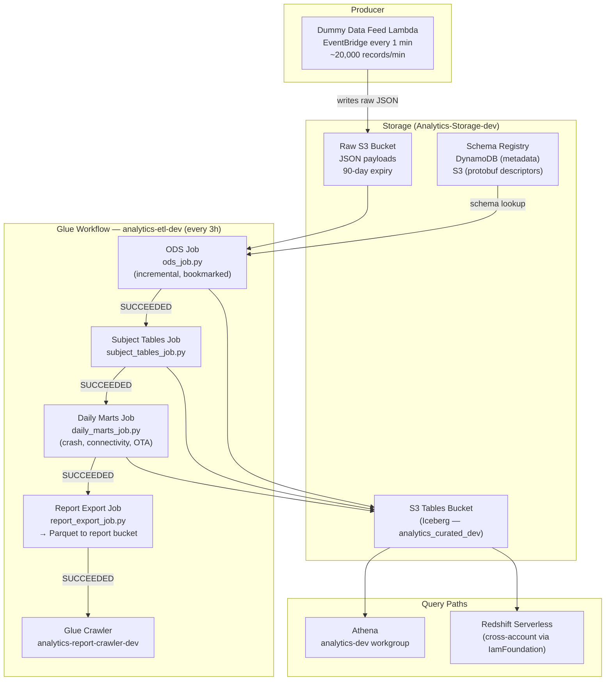
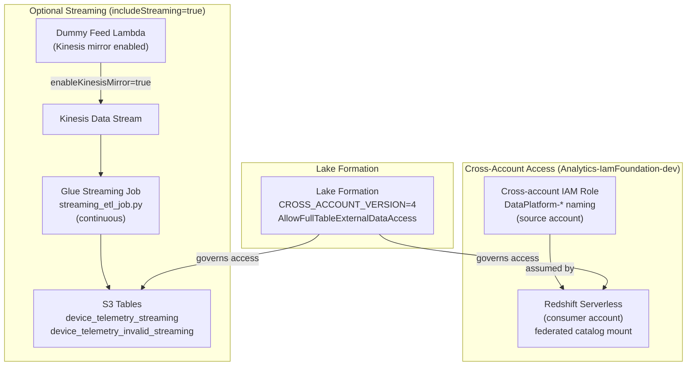

# Firmware Telemetry Iceberg Lakehouse POC

---

## Upwork Portfolio Entry

**Project title** (52 / 70 characters)
`Iceberg Lakehouse POC — S3 Tables, AWS Glue, Athena`

**Role**: Data Engineer

**Project description**

Designed and built a proof-of-concept Apache Iceberg lakehouse on AWS China, validating Amazon S3 Tables as a production-ready foundation for firmware telemetry analytics. Delivered fully reproducible infrastructure via AWS CDK (TypeScript) — a single cdk deploy provisions all resources. The core pipeline is a 4-job Glue PySpark workflow on a 3-hour schedule: ODS ingestion → subject tables → daily KPI marts → Parquet report export. Validated concurrent Glue/Athena access to the same Iceberg tables and cross-account Redshift Serverless queries without data copying.

**Skills and deliverables**

- AWS CDK (TypeScript) — full infrastructure-as-code across dev and production environments
- AWS Glue PySpark — 4-job sequential workflow (ODS ingestion, subject tables, daily marts, report export)
- Amazon S3 Tables (Apache Iceberg) — curated data layer with ACID writes, schema evolution, and time-travel
- Amazon Athena — interactive query validation against Iceberg tables
- Amazon Redshift Serverless — cross-account federated catalog query integration
- Python — Glue PySpark ETL job implementations
- DynamoDB + S3 — schema registry for runtime protobuf descriptor management
- Data quality — dead-letter pattern isolating invalid records into separate Iceberg tables

---

## Full Case Study: Firmware Telemetry Lakehouse POC

**Role**: Tech Lead — sole data engineer  
**Stack**: AWS CDK (TypeScript) · Python · AWS Glue (PySpark) · Amazon S3 Tables (Apache Iceberg) · AWS Lambda · Kinesis Data Streams · Amazon Athena · AWS Lake Formation · Redshift Serverless (cross-account query path)

---

## Problem

The existing mobile analytics platform processed both mobile app and device firmware telemetry through a Redshift Spectrum-based pipeline. As the platform matured, several architectural limitations made it increasingly difficult to extend and operate:

- **No open table format** — curated data lived in Redshift-native tables; there was no Iceberg layer for schema evolution, time-travel, or cross-engine access without copying data
- **Single-engine coupling** — making the same curated dataset available to Athena, Spark, and Redshift simultaneously required data duplication or complex synchronisation, as Redshift-native tables are not accessible to external engines
- **Protobuf decode tightly coupled to ingestion** — firmware telemetry arrives as binary protobuf payloads; the existing approach had no clean separation between raw payload storage, schema resolution, and decode, making schema version changes risky
- **No dead-letter handling** — there was no pattern for separating invalid or undecodable records from curated data at ETL time, making data quality issues invisible until they surfaced in downstream reports
- **Hand-authored CloudFormation** — cloud resources were managed in raw CloudFormation templates without higher-level construct abstractions, making it difficult to enforce consistent patterns across environments (dev/prod) and compose optional subsystems (streaming, cross-account access) cleanly

The goal was to prove out a batch-first Glue + S3 Tables (Iceberg) lakehouse on AWS as a viable architectural foundation for next-generation telemetry ingestion, with an optional streaming path and cross-account query capability validated in the same POC.

---

## Approach

1. **CDK-first infrastructure** — all AWS resources (S3 buckets, S3 Tables table bucket, Glue jobs, Kinesis stream, DynamoDB schema registry, IAM roles, Lake Formation permissions, Athena workgroup) are defined as CDK stacks in TypeScript. This makes the full environment reproducible from a single `cdk deploy` command and eliminates manual provisioning drift.

2. **S3 Tables as the curated layer** — chose Amazon S3 Tables (native Iceberg) over a self-managed Iceberg-on-S3 approach because S3 Tables handles compaction, snapshot management, and REST catalog registration automatically. This removes operational overhead while still providing full Iceberg semantics (schema evolution, time-travel, ACID writes) across Glue, Athena, and Redshift.

3. **Schema registry via DynamoDB + S3** — protobuf schema descriptors are stored as blobs in S3 with metadata (schema ID, version) in DynamoDB. Glue ETL jobs do a `GetItem` lookup at runtime to resolve the correct descriptor per record, decoupling schema lifecycle from job deployment.

4. **Batch-first, streaming-optional** — the default deployment path is a scheduled Glue batch job (every 3 hours) with job bookmarks enabled for incremental processing. The streaming path (Glue Streaming + Kinesis) is isolated into a separate CDK stack and enabled only with `-c includeStreaming=true`, keeping the default surface area small and stable during POC validation.

5. **Layered Glue workflow** — a Glue Workflow chains four conditional jobs: ODS ingestion → subject table updates → daily marts → report export + crawler. Each stage only runs if the prior stage succeeds, preventing partial pipeline runs from polluting downstream tables.

6. **Cross-account Redshift query path** — a dedicated `IamFoundation` CDK stack provisions a cross-account IAM role (`DataPlatform-*`) that allows a Redshift consumer in a separate account to mount the S3 Tables federated catalog as a resource link and query curated Iceberg tables directly via Redshift Serverless — without copying data.

---

## Architecture

### Diagram 1 — Batch Ingestion & ETL

### Diagram 2 — Optional Streaming Path & Cross-Account Access

**Batch scheduling**: The Glue Workflow runs on a cron schedule (`0 */3 * * ? *`) — 8× daily. Job bookmarks are enabled on the ODS incremental job so only new records from the raw bucket are processed each run. The backfill job (`ods_job.py` with `--run_mode backfill`) is a separate Glue job definition with bookmarks disabled, run manually for date-range replays.

**Iceberg table management**: All curated tables are defined in the CDK `StorageStack` as `s3tables.Table` constructs with explicit Iceberg schemas. S3 Tables handles compaction and snapshot expiry automatically. The `delete-enabled=false` Spark config prevents accidental data deletions during the POC phase.

**Dead-letter pattern**: Every ETL job writes undecodable or schema-invalid records to a parallel `*_invalid` Iceberg table, keeping curated tables clean and providing a queryable error surface for data quality monitoring.

**CDK environment gating**: All optional subsystems (streaming, cross-account IAM, quarantine bucket) are gated by CDK context flags (`-c includeStreaming=true`, `-c includeIamFoundation=false`). The minimal default deploy is just Storage + ETL + DummyDataFeed.

---

## Key Capabilities Delivered

| Capability | Detail |
|---|---|
| Reproducible infrastructure | Full platform deployable from `cdk deploy` — no manual console steps |
| Protobuf decode pipeline | Schema-registry-driven protobuf decoding at Glue ETL time; raw payload preserved alongside decoded JSON |
| Open table format storage | Iceberg via S3 Tables: schema evolution, time-travel, ACID writes across Glue/Athena/Redshift |
| Dead-letter capture | Invalid records separated into `*_invalid` Iceberg tables at each ETL stage |
| Multi-engine query | Same curated Iceberg tables queryable by Athena (direct) and Redshift Serverless (cross-account federated catalog) |
| Optional streaming path | Kinesis → Glue Streaming → Iceberg path additive and isolated; does not affect batch stability |
| Layered analytics tables | ODS → DWD subject tables → daily marts (crash, connectivity, OTA, reboot, shutdown) → report export |
| Report Parquet snapshots | Daily Parquet snapshots per report view written to a dedicated S3 bucket and catalogued by Glue Crawler |

---

## Outcome

- Delivered a fully reproducible Iceberg lakehouse on AWS China in a single-engineer POC — provisioned, validated, and documented end-to-end via CDK
- Validated that Amazon S3 Tables (Iceberg) supports concurrent Glue PySpark writes and Athena reads, confirming it as a viable replacement for Redshift-native storage for device firmware telemetry
- Proved Redshift Serverless cross-account access to S3 Tables via federated catalog mount (`CROSS_ACCOUNT_VERSION=4`), unblocking the path to unified querying across mobile and firmware data domains without data duplication
- Established a protobuf decode pipeline with a DynamoDB + S3 schema registry — schema changes require no job redeployment; only a new descriptor upload
- Isolated streaming and batch paths into independent CDK stacks; streaming POC validated without introducing risk to the stable batch pipeline
- POC validation phase completed as of 2026-04-23; Storage and IamFoundation stacks retained for continued query-path validation; ETL stacks cleanly decommissioned with Lake Formation grant cleanup documented in runbooks
