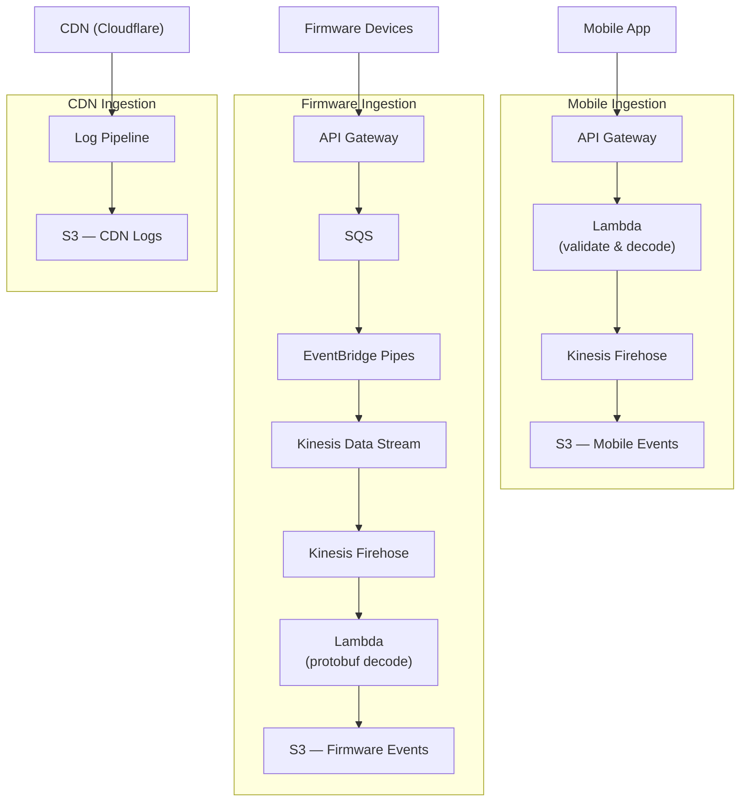
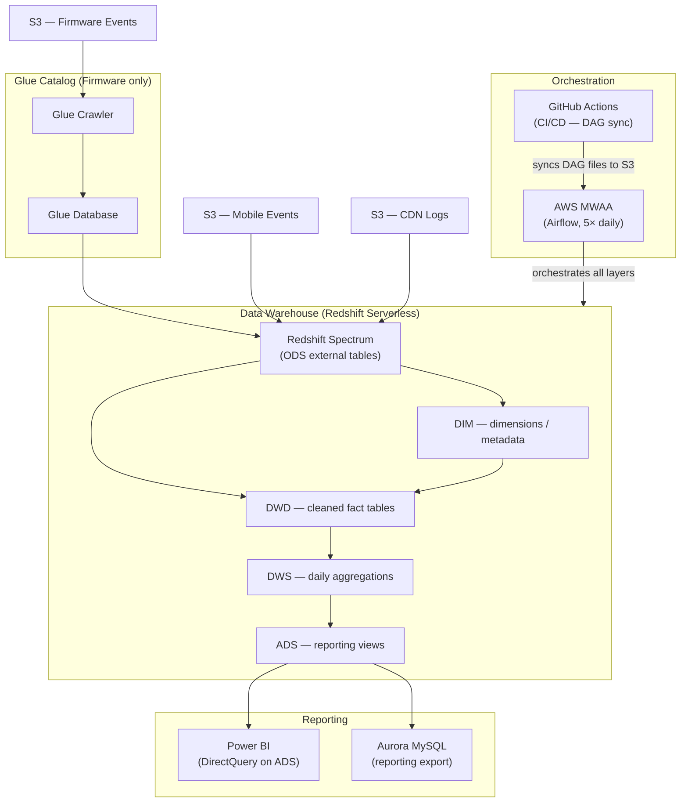

# Mobile Analytics Platform Migration to AWS

---

## Upwork Portfolio Entry

**Project title** (53 / 70 characters)
`Mobile Analytics Data Warehouse — AWS China Migration`

**Role**: Data Engineer

**Project description**

Migrated a consumer electronics company's mobile analytics platform from AliCloud to AWS China, consolidating mobile app, firmware, and CDN log data into a layered data warehouse on Amazon Redshift Serverless. As the sole data engineer, built the five-layer warehouse (ODS/DIM/DWD/DWS/ADS), Airflow ETL DAGs with backfill support, data quality monitoring, and CI/CD. Delivered daily analytics on user retention, OTA success rates, and Bluetooth connectivity. Reduced infrastructure cost by ~40% via Redshift Provisioned → Serverless migration.

**Skills and deliverables**

- Amazon Redshift Serverless — layered warehouse design (ODS/DIM/DWD/DWS/ADS) across mobile, firmware, and CDN domains
- Apache Airflow (AWS MWAA) — ETL orchestration DAGs with idempotent, backfill-safe patterns
- AWS Lambda + Kinesis Firehose — multi-source telemetry ingestion pipeline
- Redshift Spectrum — S3-based external table layer (ODS)
- Python — ETL logic and data quality monitoring
- SQL — analytical transformations: retention cohorts, OTA rates, version distribution, Bluetooth connectivity
- GitHub Actions — CI/CD for DAG synchronisation across dev and production environments
- Power BI — dataset models for business reporting

---

## Full Case Study: Mobile Analytics Platform Migration to AWS

**Role**: Tech Lead — sole data engineer  
**Stack**: Python · Apache Airflow (AWS MWAA) · Amazon Redshift Serverless · Kinesis Firehose · AWS Lambda · Redshift Spectrum · Power BI · GitHub Actions

---

## Problem

A consumer electronics company in China ran its mobile analytics platform on AliCloud DataWorks. As the product matured, several problems converged:

- **Third-party SDK dependency** — mobile event collection relied on an external vendor, adding recurring cost and limiting data ownership
- **No firmware analytics** — firmware telemetry was collected but had no modeled analytics pipeline
- **Idle compute cost** — provisioned Redshift ran at full capacity 24/7 regardless of query load
- **Fragile ETL** — hand-written SQL scripts scattered across Airflow DAGs, no version control discipline, difficult to backfill safely

The team needed to migrate off AliCloud, consolidate three data sources (mobile app, firmware, CDN logs) into a single warehouse, and do it without disrupting ongoing daily reporting.

---

## Approach

The migration ran in two phases to reduce risk.

**Phase 1** — Establish the new platform on AWS China (cn-north-1): provisioned Amazon Redshift + AWS MWAA running in parallel with the legacy system. Legacy and new pipelines were validated side-by-side before cutover.

**Phase 2** — Migrate from provisioned Redshift to Redshift Serverless once the platform was stable, eliminating idle compute spend.

Throughout both phases, a five-layer warehouse model (ODS → DIM → DWD → DWS → ADS) was applied consistently across all three data domains, with clear naming conventions and idempotent, backfill-safe ETL patterns.

---

## Architecture

### Diagram 1 — Ingestion Layer

### Diagram 2 — Data Warehouse & Reporting

**Orchestration**: Five Airflow DAGs chained via `TriggerDagRunOperator`, running on a multi-schedule (5× daily). Responsibilities: dimension refresh → source data load (ODS) → ETL fact builds (DWD) → data quality checks → MySQL export. All fact table loads use DELETE + INSERT by date partition — safe for retries and backfills.

**CI/CD**: GitHub Actions syncs DAG files to S3 on push to `develop` (dev MWAA environment) and on release publish (production).

---

## Key Metrics Delivered

| Metric Area | Example |
|---|---|
| User retention | Daily and weekly cohort retention tables |
| Product engagement | Active lifetime per device (first use → last seen) |
| Version distribution | Daily app and firmware version split |
| Connectivity | Bluetooth connect success/error rates |
| Firmware updates | OTA attempt and success rates |
| App reliability | CDN API log volume and anomaly detection |

---

## Outcome

- Migrated a multi-source analytics platform from AliCloud to AWS China in two phases with no data loss and no disruption to daily reporting
- Reduced Redshift infrastructure cost by ~40% (monthly spend: ~5,000 RMB → ~3,000 RMB) through Provisioned → Serverless migration
- Consolidated three previously independent data sources into a single layered warehouse with unified schema conventions
- Eliminated third-party SDK vendor cost and improved data ownership through an internal ingestion pipeline, reducing additional AWS spend by ~30%
- All ETL logic version-controlled and deployable via CI/CD; idempotent patterns enable safe historical backfills across any date range
- The ETL layer was subsequently migrated to dbt Core — see the **dbt Analytics Pipeline Migration** case study (`portfolio-dbt-analytics`)
