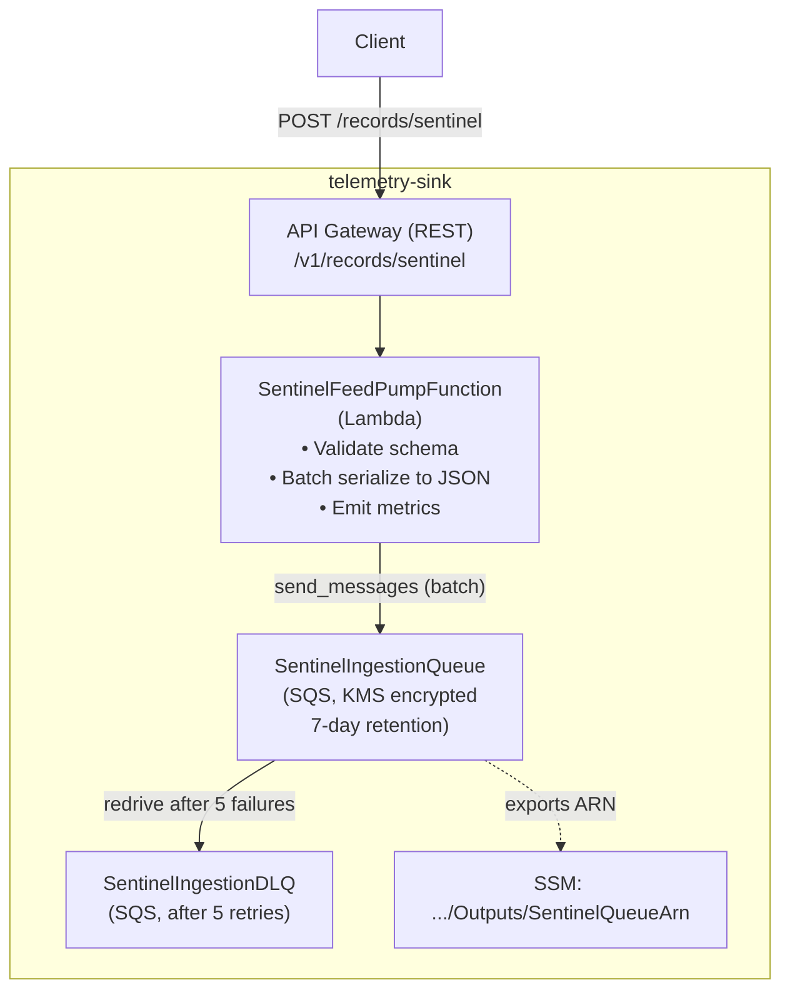
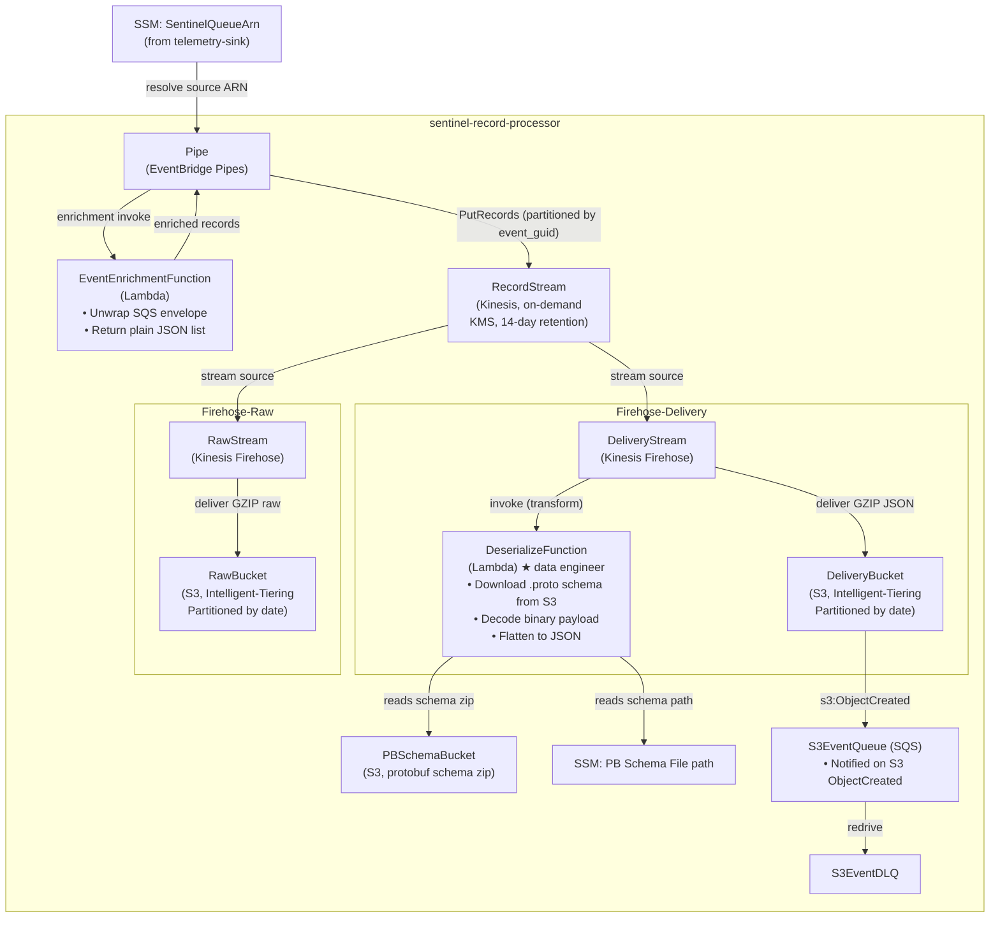
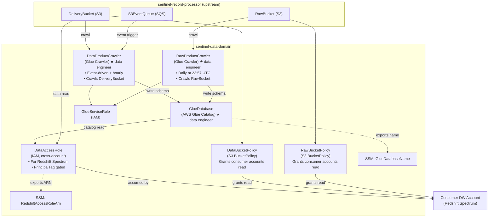
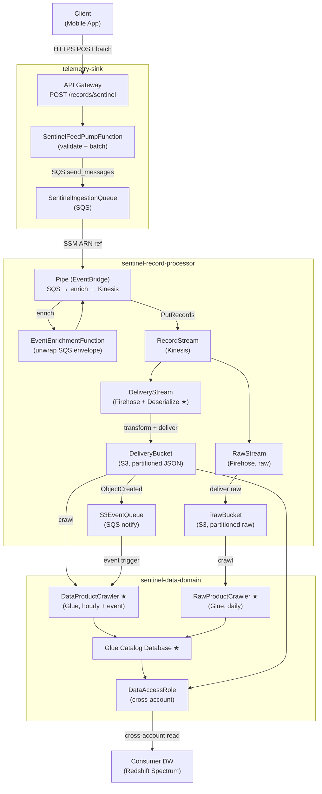

# Telemetry Schema Design & Data Layer — App Events & Firmware SDK (Tercel)

---

## Upwork Portfolio Entry

**Project title** (65 / 70 characters)
`Telemetry Schema Design & Data Layer — App Events & Firmware SDK`

**Role**: Data Engineer

**Project description**

Built the data layer of a serverless firmware telemetry pipeline on AWS China, as part of migrating from a third-party provider to an internally owned platform. Implemented a Kinesis Firehose transform Lambda in Python that downloads the protobuf schema descriptor from S3 at runtime, deserialises binary payloads, and delivers flat JSON — decoupling schema changes from Lambda redeployment. Configured Glue Crawlers for event-driven schema cataloguing and updated the downstream chain (Redshift tables, Airflow DAGs, Power BI models) to align with the new architecture.

**Skills and deliverables**

- Python — Kinesis Firehose transform Lambda (protobuf decode, Pydantic validation, JSON flattening)
- Pydantic — event schema models for firmware telemetry envelope and payload fields
- AWS Glue (Crawlers + Catalog) — event-driven and scheduled crawler configuration for decoded and raw S3 tracks
- Amazon Redshift — table schema updates aligned to new delivery format
- Apache Airflow (AWS MWAA) — DAG updates for new S3 partition structure and delivery paths
- Data contracts — cross-team schema alignment with firmware engineering team
- Unit testing — schema validation, Pydantic edge cases, and protobuf flattening logic

---

## Full Case Study: Telemetry Schema Design & Data Layer — App Events & Firmware SDK (Tercel)

**Role**: Data Engineer — data layer (cloud infrastructure designed and deployed by cloud engineer)  
**Stack**: Python 3.13 · Kinesis Firehose (transform Lambda) · AWS Glue (Crawlers, Catalog) · Amazon S3 · Amazon Redshift · AWS MWAA · Pydantic · protobuf

---

## Problem

As part of the internal SDK migration replacing a third-party telemetry provider, the company's sentinel firmware telemetry needed to move onto an internally owned data pipeline on AWS China (`cn-north-1`). The cloud engineer designed and deployed the serverless ingestion infrastructure (API Gateway → Lambda → SQS → EventBridge Pipes → Kinesis → S3). The data engineering challenges were:

- **Binary protobuf payloads** — sentinel firmware events arrive as binary protobuf. A decode Lambda embedded in the Firehose delivery stream needed to download the protobuf schema descriptor at runtime, deserialise the payload, and output flat JSON — without coupling schema changes to Lambda redeployment
- **Downstream data chain realignment** — the new ingestion architecture changed the schema shape, S3 partition structure, and delivery frequency. Glue Crawlers, Redshift table models, MWAA DAGs, and Power BI dataset models all needed to be updated to align with the new design
- **Dual-track delivery** — decoded JSON (Glue-catalogued, Redshift-queryable) and raw binary (audit and backfill) are delivered to separate S3 tracks; the data layer needed to define the schema and cataloguing strategy for both
- **Cross-team data contract** — firmware engineering needed a published event envelope and payload schema to develop against; without a defined contract, upstream SDK and downstream pipeline would diverge independently

---

## Approach

The cloud engineer owned the three-domain SAM infrastructure (API Gateway, SQS, EventBridge Pipes, Kinesis, Firehose delivery streams, S3 bucket policies, cross-account IAM, CloudWatch alarms, CI/CD). My responsibility covered the data layer within that infrastructure:

1. **Schema definition** — defined the sentinel protobuf envelope schema, established field naming conventions, and maintained the `.proto` schema descriptor in S3. Defined the flat JSON target schema for Redshift loading, aligning field types and names with the existing warehouse convention. Collaborated with firmware engineering to establish the data contract.

2. **Firehose decode Lambda (`DeserializeFunction`)** — implemented the Python transform Lambda embedded in the Firehose delivery stream. The Lambda downloads the protobuf descriptor from S3 at runtime, deserialises the binary payload, unwraps the event envelope, and outputs a flat GZIP JSON record. Schema updates are deployed by uploading a new descriptor to S3 — no Lambda redeployment required.

3. **Glue Crawler configuration** — configured the event-driven delivery crawler (CRAWL_EVENT_MODE, triggered by S3 ObjectCreated via SQS) and the daily raw crawler (CRAWL_NEW_FOLDERS_ONLY). Managed the Glue Catalog schema for both the decoded and raw tracks.

4. **Downstream data chain updates** — updated Redshift table models to align with the new flat JSON schema and S3 partition structure; updated MWAA ETL DAGs for the new delivery paths; updated Power BI dataset models to reflect schema changes.

5. **Unit tests** — wrote unit tests for schema validation, Pydantic model edge cases, and the protobuf flattening logic.

---

## Architecture

The following diagrams show the full pipeline. Cloud infrastructure (grey areas) was designed and deployed by the cloud engineer. Data layer components are highlighted in the narrative above.

### Domain 1: `telemetry-sink`

---

### Domain 2: `sentinel-record-processor`

---

### Domain 3: `sentinel-data-domain`

---

### Overview: All Three Domains

*(★ = data engineer owned)*

---

The pipeline runs in three stages. Cloud infrastructure ownership and data layer ownership per domain:

| Stage | Domain | Cloud Engineer | Data Engineer |
|---|---|---|---|
| **Ingest** | `telemetry-sink` | API Gateway, Lambda (FeedPump), SQS, DLQ, alarms | — |
| **Process** | `sentinel-record-processor` | EventBridge Pipes, Kinesis, Firehose delivery streams, S3 buckets | Decode Lambda (DeserializeFunction), protobuf schema descriptor, schema definition |
| **Serve** | `sentinel-data-domain` | IAM cross-account role, S3 bucket policies, SSM exports | Glue Crawlers (configuration + management), Glue Catalog schema |
| **Downstream** | Redshift + MWAA | — | Redshift table models, MWAA DAGs, Power BI dataset models |

---

## Key Capabilities Delivered

| Capability | Detail |
|---|---|
| Runtime protobuf decode | Implemented the Firehose transform Lambda: downloads `.proto` schema descriptor from S3 at delivery time, deserialises binary payload, flattens envelope + context + payload to JSON — schema updates require only an S3 descriptor upload, no redeployment |
| Pydantic schema validation | Defined sentinel event envelope and payload schemas with strict field typing; validated records in the Firehose transform step before delivery to S3 |
| Glue Crawler management | Configured event-driven delivery crawler (CRAWL_EVENT_MODE via S3→SQS trigger) for low-latency schema updates, and daily raw crawler (CRAWL_NEW_FOLDERS_ONLY); managed Glue Catalog schema for both tracks |
| Downstream data chain alignment | Updated Redshift table models, MWAA ETL DAGs, and Power BI dataset models to align with the new schema and S3 partition structure from the new ingestion architecture |
| Cross-team data contract | Collaborated with firmware engineering to define the sentinel event envelope structure; maintained the schema descriptor in S3 for upstream SDK team consumption |
| Unit test coverage | Wrote unit tests for schema validation, Pydantic model edge cases, and protobuf flattening logic |

---

## Outcome

- Firmware telemetry pipeline brought fully in-house on AWS China, replacing the third-party provider — as part of the broader internal SDK migration that also eliminated third-party vendor costs and reduced AWS infrastructure spend by ~30%
- Protobuf schema decoupled from Lambda deployment: schema updates require only an S3 descriptor upload; zero Lambda redeployments for schema evolution
- Downstream Redshift and MWAA pipelines aligned with the new ingestion architecture without disrupting ongoing analytics reporting
- Raw binary track preserved for audit and backfill; decoded track queryable via Glue Catalog and Redshift Spectrum
